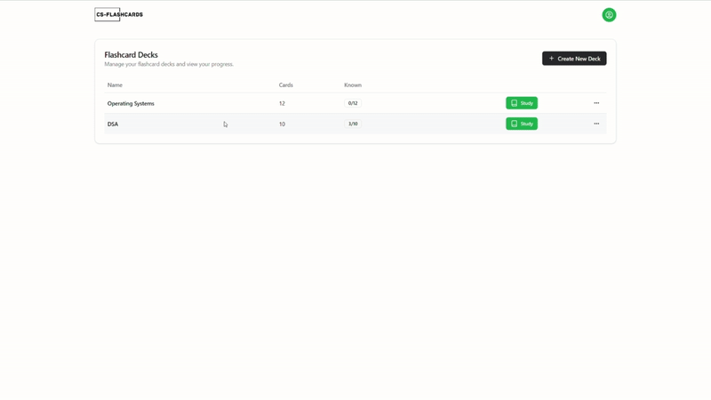

<h1 align="center">cs-flashcards</h1>

<h4 align="center">An open-source, fullstack flashcards web app</h4>

<h3 align="center"></h3>

---

## Getting Started

> [!NOTE]  
> The project is currently in active development, so occasional issues or disruptions can be expected.

To run this project locally, follow the steps below:

### 1. Fork and Clone the Repository

- Fork the repository to your GitHub account.
- Clone the forked repository to your local machine:

  ```bash
  git clone https://github.com/yoyocharlie/cs-flashcards-open.git
  ```

  ```bash
  cd cs-flashcards-open
  ```

### 2. Install Dependencies

- Install the necessary dependencies using `pnpm`:

  ```bash
  pnpm install
  ```

### 3. Set Up Environment Variables

- Create a `.env` file in the root directory. You can copy the contents of `.env.example` to start with.

- Configure your environment variables in the `.env` file. The project is configured to use NextAuth with the Google auth provider. You will need to set up `GOOGLE_CLIENT_ID` and `GOOGLE_CLIENT_SECRET`.

- Instructions for setting up credentials with Google can be found [here](https://support.google.com/cloud/answer/6158849?hl=en).

> [!NOTE]  
> In the Google dev console, your authorized URI for development will be `http://localhost:3000/api/auth/callback/google`

### 4. Push the Database Schema

- Push the Prisma schema to your SQLite database:

  ```bash
  pnpm db:push
  ```

### 5. Run the Development Server

- Start the development server:

  ```bash
  pnpm dev
  ```

- Your application should now be running on `http://localhost:3000`.

## Other Useful Commands

- To open Prisma Studio and manage your database visually:

  ```bash
  pnpm db:studio
  ```

- To generate Prisma client and run migrations:

  ```bash
  pnpm db:generate
  pnpm db:migrate
  ```

---

## Running with Docker

You can run this project using Docker for easier setup and consistency across environments.

### 1. Build and Run the Docker Container

```bash
docker-compose up --build
```

### 2. Environment Variables

Ensure you have the necessary environment variables set up in a `.env` file or export them in your shell before running the Docker container:

- `GOOGLE_CLIENT_ID`
- `GOOGLE_CLIENT_SECRET`

### 3. Access the Application

Once the container is up and running, you can access the application at `http://localhost:3000`.
